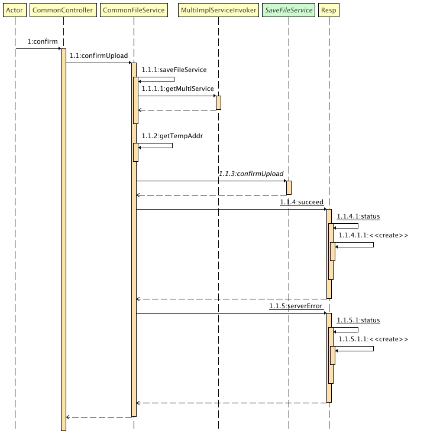
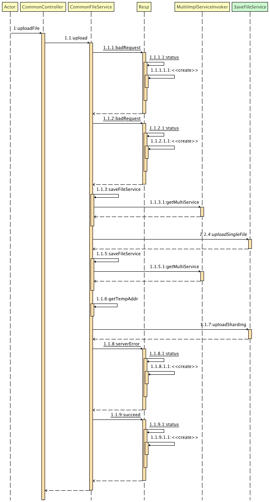
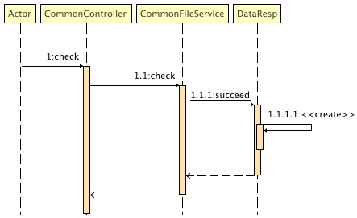

# 大文件切片上传工具包

**当前demo并未使用数据库，请自行根据需求添加**

---

## 所用到的技术栈
`Spring Boot`、`Docker`

## 当前主要功能
- 默认文件不存在
- 大文件切片上传至本地缓存区（在有数据库的情况下支持断点续传）
- 将缓存区文件转存至存储区

## 使用方法
### 1. DEV环境下
**请详情阅读[开发须知](./README.md#开发相关)后进行操作**

按照个人需求更改完[环境变量](./envs/demo.env)后在启动配置中激活即可

### 2. 生产/测试环境下
使用默认配置后在[compose](./docker-compose.yml)中按需映射实际目录即可

## 架构与逻辑(暂定)
### 1. 前后端交互逻辑

### 2. 方法调用流程
#### 2.1 查询文件是否存在

#### 2.2 文件上传

#### 2.3 将文件从缓存区移至存储区

# 开发相关
本项目是由 [Intellij IDEA](https://www.jetbrains.com/idea/) 编辑开发，JDK版本为 `jdk8`，使用 `MAVEN` 构建

❗️❗️❗️运行时环境变量时使用`.env` 文件，并使用 [EnvFile](https://plugins.jetbrains.com/plugin/7861-envfile) 插件调用，`VSCode`与`Eclipse`用户请自行寻找适合的插件